# 냠픽 Nyampick

냠픽은 아이 식단 기록, 냉장고 재료 관리, 영수증 스캔, AI 유아식 레시피 추천을 하나의 흐름으로 연결한 모바일 중심 웹앱입니다.

## Screenshots

| 랜딩 | 식단 홈 | 식단 상세 |
| --- | --- | --- |
| 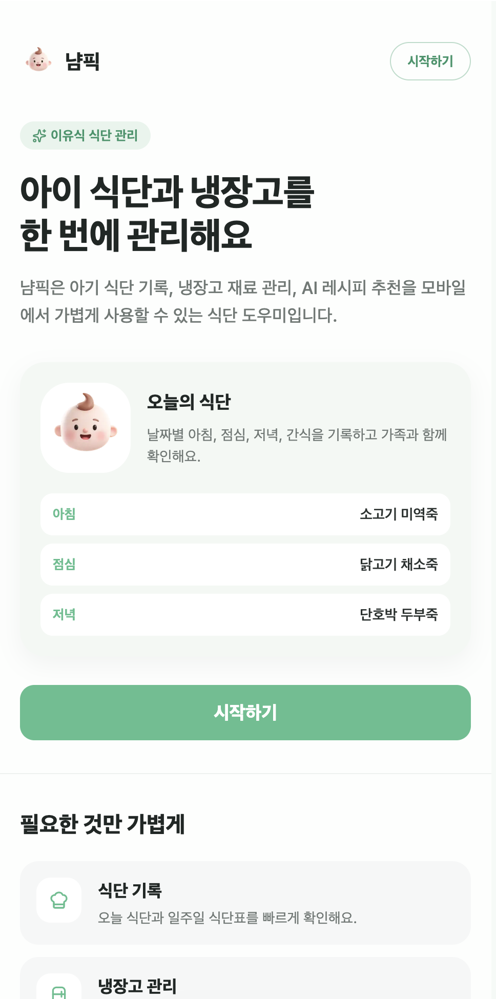 | 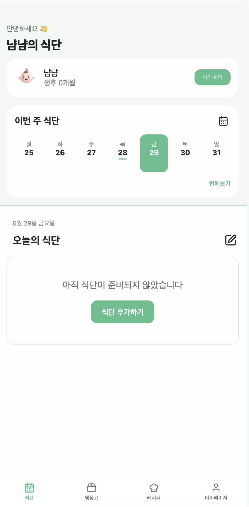 | 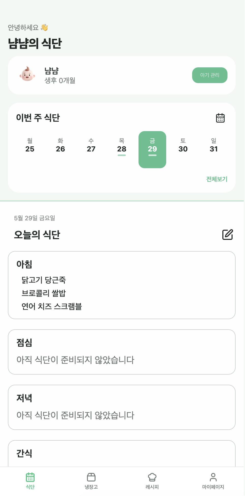 |

| 식단 수정 | 메뉴 추가 | 냉장고 |
| --- | --- | --- |
| 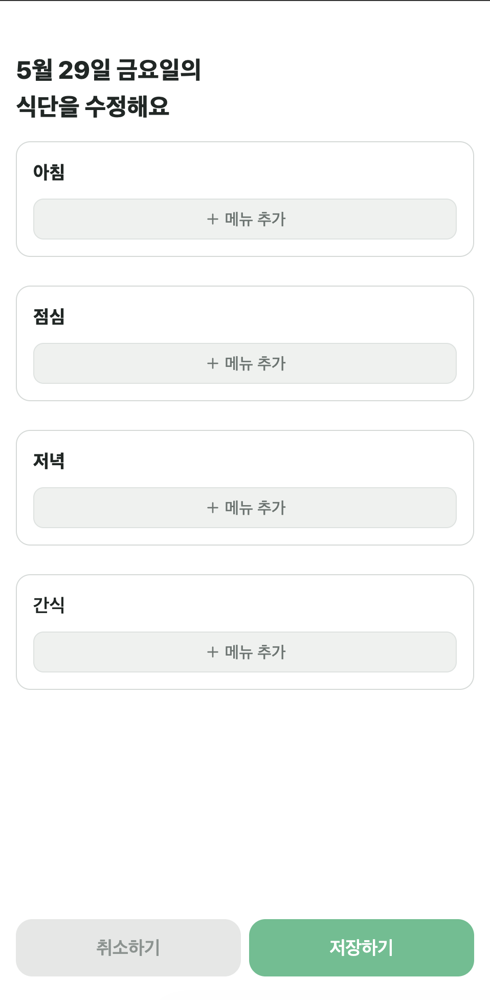 | 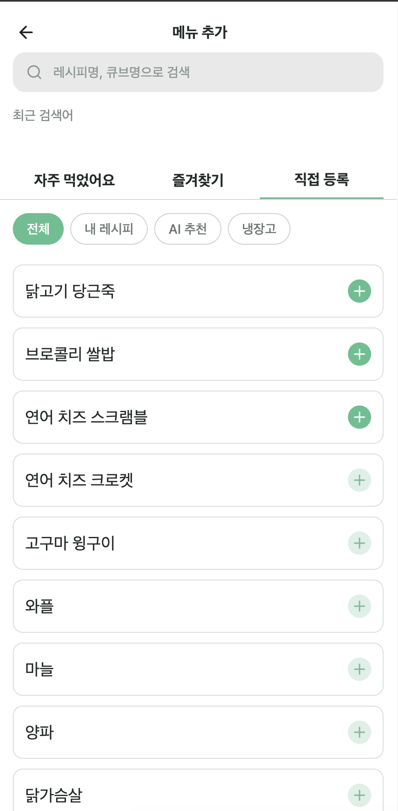 | 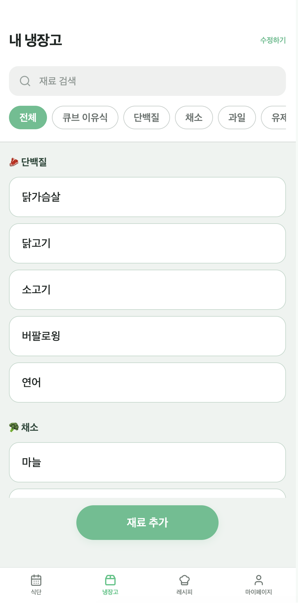 |

| 재료 입력 | 재료 확인 | 레시피 북 |
| --- | --- | --- |
| 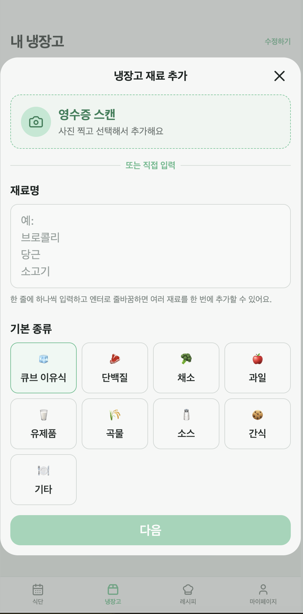 | 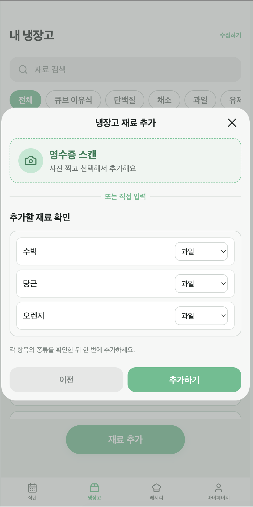 | 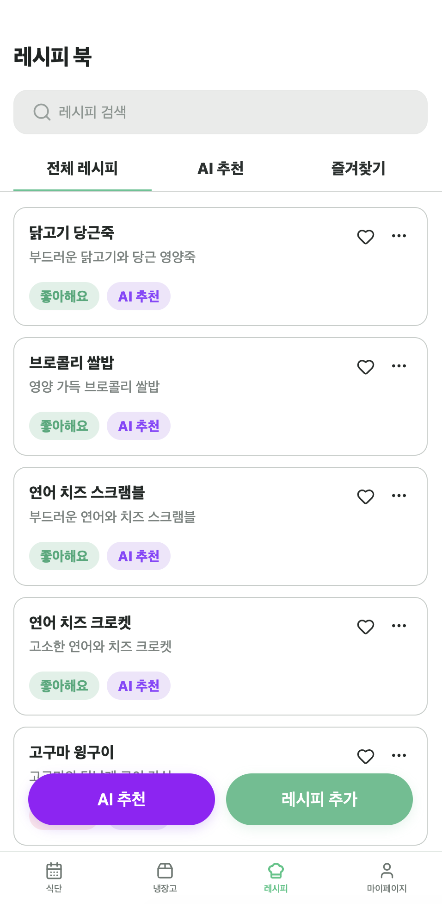 |

| AI 재료 선택 | AI 추천 결과 | 마이페이지 |
| --- | --- | --- |
| 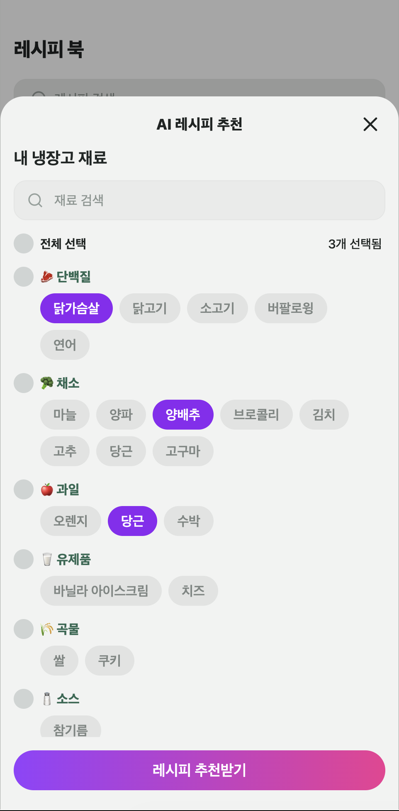 | 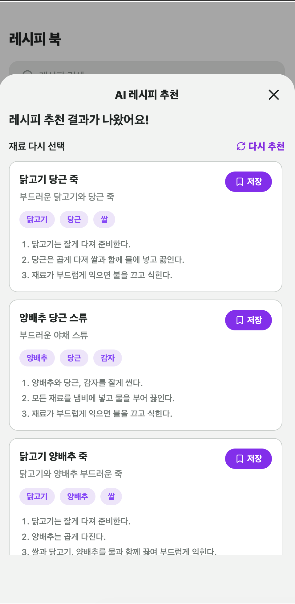 | 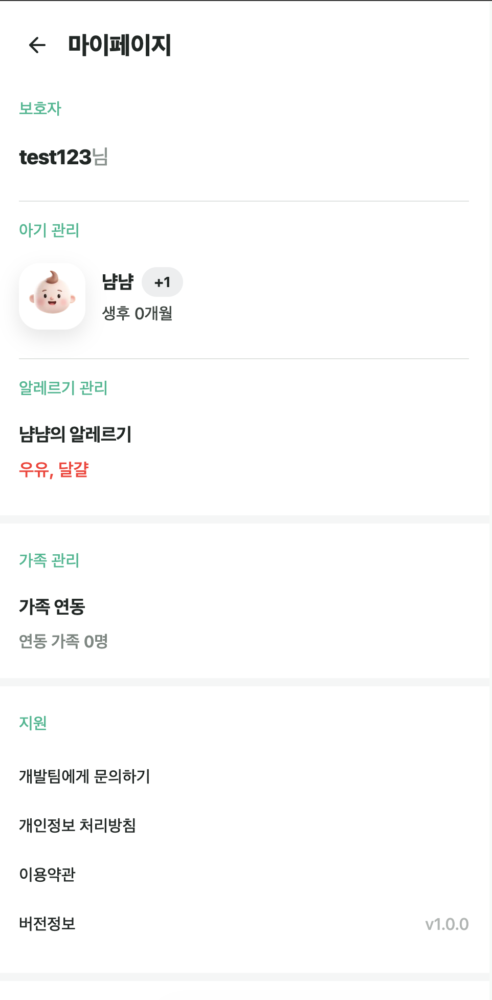 |

## 문제 정의

아이 식단을 관리할 때 보호자는 여러 정보를 따로 관리해야 합니다.

- 오늘 무엇을 먹였는지 기록해야 함
- 냉장고에 어떤 재료가 남았는지 확인해야 함
- 장 본 재료를 다시 수동으로 입력해야 함
- 남은 재료로 만들 수 있는 유아식 메뉴를 고민해야 함
- AI 추천은 결과가 매번 달라 품질을 그대로 신뢰하기 어려움

냠픽은 이 문제를 식단 기록, 냉장고 데이터, 영수증 OCR, AI 추천 품질 검증을 연결해서 해결합니다.

## 주요 기능

| 영역 | 기능 |
| --- | --- |
| 식단 기록 | 아침, 점심, 저녁, 간식 기록 |
| 식단표 | 주간 식단 전체보기, 이미지 저장 |
| 냉장고 | 재료 분류, 이유식 큐브 관리, 중복 재료 방지 |
| 영수증 | 사진 기반 재료 후보 추출, 선택 항목 냉장고 추가 |
| AI 추천 | 냉장고 재료 기반 유아식 레시피 추천 |
| 가족 | 가족 코드 기반 데이터 공유 |
| 아이 관리 | 아이 정보 관리, 대표 아이 설정 |
| SEO | 공개 랜딩/가이드 페이지, sitemap, robots 설정 |

## AI 추천 품질 관리

AI 추천 결과를 바로 사용자에게 노출하지 않고, 아래 흐름을 통과한 추천만 사용합니다.

```text
사용자 재료
→ 입력 재료 정규화
→ OpenAI 호출
→ Zod schema 검증
→ 추천 데이터 정규화
→ quality gate
→ reason code 집계
→ 최종 추천 반환
```

### 정규화

- `친환경 애호박 1개` → `애호박`
- `무항생제 닭안심 300g` → `닭고기`
- `서울우유 1L` → `우유`
- 조리 단계의 `1.`, `2)`, `-` 같은 목록 기호 제거

### Quality Gate

추천은 아래 기준을 통과해야 합니다.

- 제목/부제 길이 제한
- 재료 3개 이상
- 조리 단계 3개 이상
- 출처명과 출처 URL 존재
- 금지 조합 제외
- 알레르기 가능 재료는 주의 문구 포함
- 사용자 입력 재료와 충분히 관련 있음

탈락 시에는 boolean만 남기지 않고 reason code를 기록합니다.

```ts
type RecipeRejectReason =
  | "title_too_long"
  | "subtitle_too_long"
  | "too_few_ingredients"
  | "too_few_steps"
  | "missing_source"
  | "awkward_pair"
  | "missing_allergy_caution"
  | "not_enough_input_match";
```

### Eval Report

실제 OpenAI 호출 결과를 history로 저장하고, 같은 eval case를 반복 측정합니다.

현재 리포트 기준:

| Metric | Value |
| --- | ---: |
| Total cases | 20 |
| Measured cases | 20 |
| Pending cases | 0 |
| Pass rate | 95% |
| Quality score | 99% |
| Valid recommendations | 100% |
| Source validity | 100% |
| Production rejected recipes | 0 |

관련 문서:

- [AI Recipe Quality Strategy](docs/ai-recipe-quality-strategy.md)
- [AI Recipe Quality Report](docs/ai-recipe-quality-report.md)
- [AI Recipe Eval Cases](docs/ai-recipe-eval-cases.json)

### AI 모듈 구조

AI 추천 로직은 OpenAI 호출과 품질 검증 책임을 분리했습니다.

| 파일 | 책임 |
| --- | --- |
| `src/lib/server/recipe-ai.ts` | OpenAI 호출, strict/fallback 실행, 최종 결과 조립 |
| `src/lib/ai/recipe-prompt.ts` | strict/fallback 프롬프트 생성 |
| `src/lib/ai/recipe-response-parser.ts` | AI JSON 응답 파싱, Zod schema 검증 |
| `src/lib/ai/ingredient-normalize.ts` | 사용자 입력/영수증 재료명 정규화 |
| `src/lib/ai/recipe-normalize.ts` | 추천 레시피 제목, 재료, 조리 단계 정규화 |
| `src/lib/ai/recipe-quality-gate.ts` | 품질 기준 검사, 탈락 reason code 판정 |
| `src/lib/ai/recipe-quality-telemetry.ts` | 추천 통과/탈락 수와 reason code 집계 |
| `src/lib/ai/recipe-types.ts` | AI 추천 관련 공통 타입 |

## 기술 스택

| 분류 | 기술 |
| --- | --- |
| Framework | Next.js 14 App Router |
| UI | React 18, TypeScript, Tailwind CSS |
| Auth/DB | Supabase Auth, Supabase Database |
| AI | OpenAI API, Zod schema validation |
| State/UI | Zustand, React Hook Form, Radix UI, Sonner |
| Quality | Node test runner, ESLint, GitHub Actions |
| Deploy | Vercel |

## 주요 라우트

| Route | 설명 |
| --- | --- |
| `/landing` | 공개 랜딩 페이지 |
| `/auth` | 로그인/회원가입 |
| `/` | 홈 |
| `/meal` | 식단 |
| `/meal/edit` | 식단 편집 |
| `/meal/overview` | 식단 전체보기 |
| `/fridge` | 냉장고 |
| `/fridge/edit` | 냉장고 편집 |
| `/recipe` | AI 레시피 추천 |
| `/children` | 아이 관리 |
| `/family` | 가족 연동 |
| `/mypage` | 마이페이지 |

## API

| API | 설명 |
| --- | --- |
| `GET /api/home/summary` | 홈 요약 |
| `GET /api/fridge/items` | 냉장고 재료 조회 |
| `POST /api/fridge/items` | 냉장고 재료 추가 |
| `PATCH /api/fridge/items` | 냉장고 재료 수정 |
| `DELETE /api/fridge/items` | 냉장고 재료 삭제 |
| `POST /api/fridge/receipt-scan` | 영수증 이미지 분석 |
| `POST /api/fridge/receipt-confirm` | 영수증 후보 확정 |
| `POST /api/recipes/recommendations` | AI 레시피 추천 |
| `GET /api/recipes/saved` | 저장 레시피 조회 |
| `POST /api/recipes/saved` | 레시피 저장 |
| `GET /api/profile` | 프로필 조회 |
| `GET /api/family` | 가족 정보 조회 |
| `GET /api/children` | 아이 목록 조회 |
| `POST /api/children` | 아이 추가 |

자세한 요청/응답 형식은 [API Spec](docs/api-spec.md)을 참고합니다.

## 시작하기

```bash
npm install
npm run dev
```

개발 서버는 기본적으로 `http://localhost:3000`에서 실행됩니다.

## 환경 변수

로컬 개발은 `.env.local`, 배포 환경은 Vercel 환경 변수에 설정합니다.

```env
NEXT_PUBLIC_APP_URL=http://localhost:3000
NEXT_PUBLIC_CANONICAL_URL=https://www.nyampick.kr

NEXT_PUBLIC_SUPABASE_URL=...
NEXT_PUBLIC_SUPABASE_ANON_KEY=...
SUPABASE_SERVICE_ROLE_KEY=...

OPENAI_API_KEY=...
OPENAI_MODEL=gpt-4.1-mini
OPENAI_VISION_MODEL=gpt-4.1-mini
```

## 검증

```bash
npm run test:unit
npm run lint
npm run build
```

최근 로컬 기준:

| 항목 | 결과 |
| --- | ---: |
| Unit tests | 24 passed |
| Line coverage | 96.57% |
| Branch coverage | 87.85% |
| Function coverage | 96.88% |

AI 품질 리포트:

```bash
npm run ai:quality
```

실제 OpenAI 호출로 eval case를 측정:

```bash
npm run ai:quality:run
AI_QUALITY_CASES=R16,R20 npm run ai:quality:run
```

## 브랜치 전략

현재 개발 흐름은 아래 기준으로 운영합니다.

```text
feature/fix branch
→ dev PR
→ dev에서 확인
→ 큰 단위 완성 시 dev → main
→ Vercel production 배포
```

작은 UI 수정은 여러 커밋을 모아 `dev` PR로 올리고, AI/인증/API처럼 영향 범위가 큰 기능은 기능 단위 PR로 나눕니다.

## CI/CD

GitHub Actions는 PR마다 아래 검증을 실행합니다.

- `npm ci`
- `npm run lint`
- `npm run test:unit`
- `npm run build`

`main`에 반영되면 Vercel production 배포가 진행됩니다.

## 문서

- [Development Workflow](docs/development-workflow.md)
- [Career Roadmap](docs/career-roadmap.md)
- [Interview Prep](docs/interview-prep.md)
- [Performance Baseline](docs/performance-baseline.md)
- [API Latency History](docs/api-latency-history.md)
- [Deploy ENV Checklist](docs/deploy-env-checklist.md)
- [DTO Guideline](docs/dto-guideline.md)
